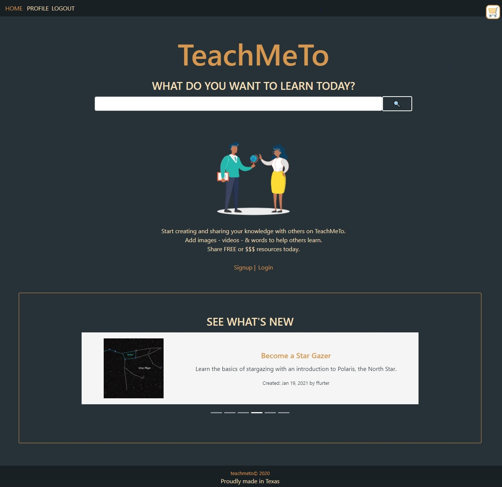

# Teach Me To

  ## DESCRIPTION
  This application is a place to search and find articles, images, 
  and videos on how to get better in my area of interest.

  ## Table of Contents
  * [Installation](#installation)
  * [Usage](#usage)
  * [Technologies](#technologies)
  * [Contribution](#contribution)
  * [Contributers](#contributers)
  * [Questions](#questions) 
  
  ## Installation
  npm install in the root of the repository, then npm start

  ## Usage  
  You can access from your _favorite browser on your **computer, ipad, or mobile phone**_.
  Users could search articles of interest, where they can find context, images, videos about what it was searched.
  Users could also register to be able to create this articles with any area of interest, and be availe to catch people interest.
  Users that have articles can also make that article to accept donations.

  ## Technologies

  ### MongoDB
  Is a cross-platform document-oriented database program. Classified as a NoSQL database program.
  ### Express
  is a back end web application framework for Node, it is designed for building web applications and APIs.
  ### React
  React can be used as a base in the development of single-page or mobile applications.
  ### Node.js
  Is an open source, cross-platform runtime environment for developing server-side and networking applications.
  ### GraphQL
  Is a syntax that describes how to ask for data, and is generally used to load data from a server to a client.
  ### Stripe
  Is a JavaScript library which you can wire into your checkout form to handle the credit card information.
  ### Mongoose
  It manages relationships between data
  ### JWT
  JSON Web Token (JWT) that defines a compact and self-contained way for securely transmitting information between parties as a JSON object.
  

  ## Contribution
  * Add Rating
  * Add Space for Reviews
  * Use to flag inappropriate content
  * Set Up Pay-To-View Functionality
  * Create Payment Statement for Donations 
  
  ## Contributers
    Visit per GitHubs:
    [Elena](https://github.com/evkonradi),
    [Sarah](https://github.com/sidoniag),
    [Jennifer](https://github.com/jenlpac),
    [AlfonsoBarreto](https://github.com/pochobs)

  ## Questions
  If you have any additional questions not answered here or wish to contact me regarding developments, please email us at 
  
  [evkonradi@gmail.com](mailto:evkonradi@gmail.com),
  [@gmail.com](mailto:@gmail.com ),
  [@gmail.com](mailto:@gmail.com),
  [pochobs@gmail.com](mailto:pochobs@gmail.com)

  ## Questions
  Home Page Preview:

  

